前置要求：ubuntu22.04环境，安装node.js，下载并编译代码仓库electron代码

## 一、下载node-sqlite3源码到Ubuntu编译环境下（本文使用的是5.1.7版本，其他版本类似）
GitHub地址如下：https://github.com/TryGhost/node-sqlite3
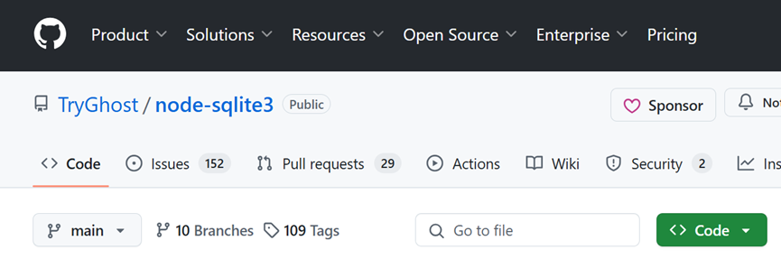
```shell
# 拉取代码
git clone https://github.com/TryGhost/node-sqlite3
```
## 二、打开node-sqlite3源码并进行适当修改
**（一）**修改文件node-sqlite3/lib/sqlite3-binding.js为如下图所示：
```javascript
const binding = require('/data/storage/el1/bundle/libs/arm64/node_sqlite3.node');
module.exports = exports = binding;
```
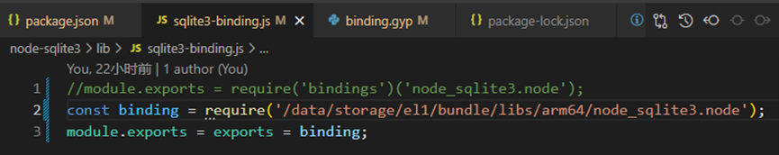

**（二）**将附件中的electron-napi-library文件夹拷贝到node-sqlite3目录下（如下图所示）
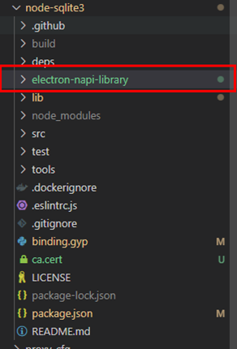

**（三）**修改文件node-sqlite3/binding.gyp
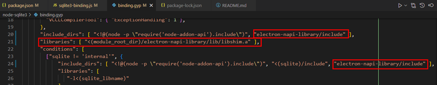

如上图所示：
在`"include_dirs"`中增加：`"electron-napi-library/include"` 
	在`"include_dirs"`下新增一行：
`"libraries": [ "<(module_root_dir)/electron-napi-library/lib/libshim.a" ],`
	在`"conditions"`的`"include_dirs"`中增加：`"electron-napi-library/include"`
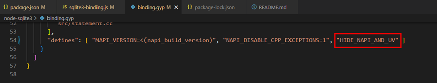

如上图所示：
	在`"defines"`中增加：`"HIDE_NAPI_AND_UV"`
**（四）**修改文件node-sqlite3/package.json
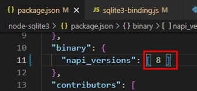

如上图所示：
将`"napi_versions"`修改为`8`

## 三、配置编译环境
Electron和addon必须用相同的编译工具链来编译
例如，electron源码路径是：`/opt/code/dev_chromium/dev_electron/`
那么，编译工具链的路径就是：
`/opt/code/dev_chromium/dev_electron/src/ohos_sdk/openharmony/native/llvm/bin/`
根据自己的编译环境设置环境变量：
```sh
export CC="/opt/code/dev_chromium/dev_electron/src/ohos_sdk/openharmony/native/llvm/bin/clang --target=aarch64-linux-ohos"
export CXX="/opt/code/dev_chromium/dev_electron/src/ohos_sdk/openharmony/native/llvm/bin/clang++ --target=aarch64-linux-ohos"
export LD="/opt/code/dev_chromium/dev_electron/src/ohos_sdk/openharmony/native/llvm/bin/lld --target=aarch64-linux-ohos"
export STRIP="/opt/code/dev_chromium/dev_electron/src/ohos_sdk/openharmony/native/llvm/bin/llvm-strip"
export RANLIB="/opt/code/dev_chromium/dev_electron/src/ohos_sdk/openharmony/native/llvm/bin/llvm-ranlib"
export OBJDUMP="/opt/code/dev_chromium/dev_electron/src/ohos_sdk/openharmony/native/llvm/bin/llvm-objdump"
export OBJCOPY="/opt/code/dev_chromium/dev_electron/src/ohos_sdk/openharmony/native/llvm/bin/llvm-objcopy"
export NM="/opt/code/dev_chromium/dev_electron/src/ohos_sdk/openharmony/native/llvm/bin/llvm-nm"
export AR="/opt/code/dev_chromium/dev_electron/src/ohos_sdk/openharmony/native/llvm/bin/llvm-ar"
export CFLAGS="-fPIC -D__MUSL__=1"
export CXXFLAGS="-fPIC -D__MUSL__=1"
```

## 四、编译
1.	进入node-sqlite3目录并配置华为镜像仓库

```sh
cd ~/node-sqlite3
npm config set registry http://mirrors.tools.huawei.com/npm/
```
2.	在.npmrc中添加参数，指定从目标地址获取头文件

```
# ~/.npmrc
disturl=https://electronjs.org/headers
```
3.	开始编译

```sh
npm install --verbose --build-from-source --runtime=electron --debug --target=25.3.2 --dist-url=https://electronjs.org/headers
```
注：“--target=25.3.2”该项为您的electron的版本。当前两个Electron版本分别为25.3.2和34.0.2编译时需要更换为自己本地的版本；
4. 编译完成
短暂等待编译完成后，如下图所示：

以下路径可见库文件生成：node-sqlite3/build/Debug/node_sqlite3.node
##### 编译报错解决：
**(一)**如果在编译时报类似于：

```
audit error FetchError: request to https://registry.npmjs.org/-/npm/v1/security/audits/quick failed, reason: self-signed certificate in certificate chain；
```
如上错误，可以尝试配置npm忽略SSL证书验证来解决该问题：

```sh
npm config set strict-ssl false
```
**(二)**如果报如下图所示的错误：
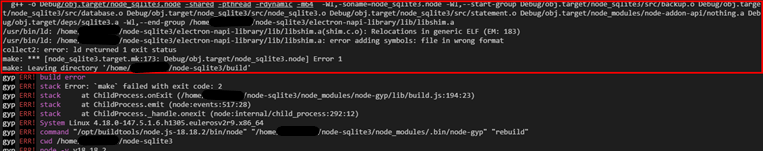
这时请检查上面编译工具链的环境变量的配置，是否配置成功。

**(三)**如果您在内网环境下，可能会出现下载node-v20.0.0-headers.tar.gz失败之类的报错，可能是网络问题，设置网络代理让linux可以访问外网，再次运行编译命令即可。

## 五、在Electron工程中使用编译好的sqlite3
1. 准备Electron工程
该步骤可选择已提供的构建包，或者您的项目工程。
2. 拷贝测试demo
附件electron-example.zip中提供了一个node_sqlite3的测试demo。使用方法如下：
将附件electron-example.zip解压后的文件（如下图）
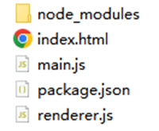

覆盖拷贝到工程目录：ohos_hap/web_engine/src/main/resources/resfile/resources/app/下（如下图）：
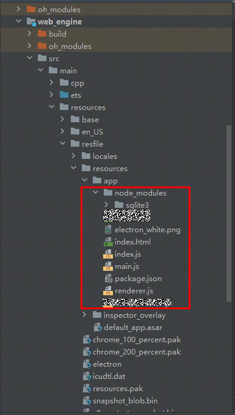

3. 在Ubuntu系统中的node-sqlite3/build/Debug/node_sqlite3.node目录下找到node_sqlite3.node（如下图），把它放置在你的Electron工程目录： ohos_hap\electron\libs\arm64-v8a
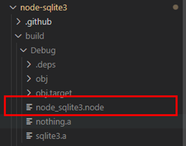

上图为Ubuntu中，下图为Windows中的Electron工程

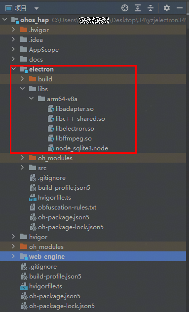
4. 将ubuntu系统中的**node-sqlite3/lib文件夹**和**node-sqlite3/package.json文件**，拷贝到目录下：ohos_hap\web_engine\src\main\resources\resfile\resources\app\node_modules\sqlite3
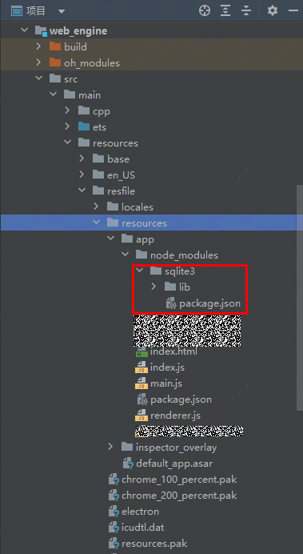

5. 构建并安装hap包，打开electron，`ctrl+shift+i`打开开发者工具，如果console里打印出了如下的日志，则调用成功：
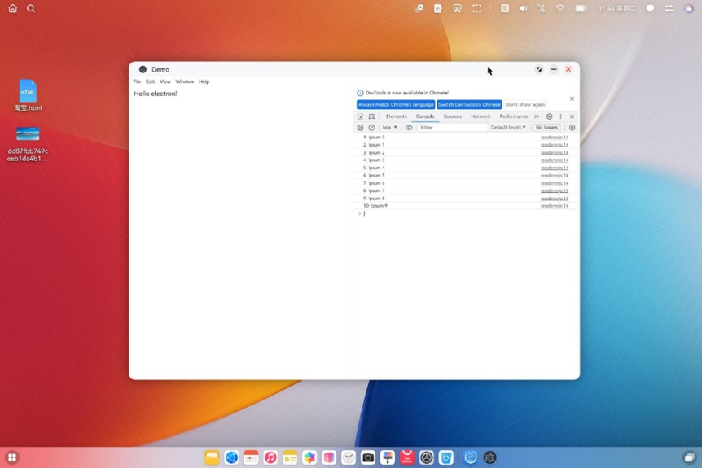